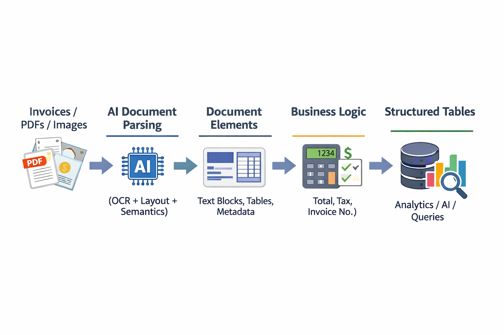

# Databricks IDP Invoice Processing

An intelligent invoice parsing pipeline using Databricks AI capabilities to automatically extract structured data from raw invoice documents.

## Architecture



## Overview

Invoices come in all shapes, sizes, and layouts. Whether from vendors, partners, or internal systems, each document may have a unique format, making traditional rule-based parsing fragile and expensive to maintain. This project demonstrates how to use Databricks' `ai_parse_document` capability combined with Spark to build a scalable and intelligent document processing pipeline.

### Goals

- Accept raw invoices (PDFs/images) from diverse sources
- Understand layout and content using AI-powered document parsing
- Extract key business fields such as:
  - Invoice Number
  - Invoice Date
  - Due Date
  - Line Items (description, quantity, unit price, amount)
  - Subtotal, Tax, and Total Due
- Convert unstructured documents into structured, analytics-ready tables

## How It Works

### 1. Load Raw Documents

Raw invoice PDFs are stored in Databricks Volumes and loaded as binary content to preserve their structure:

```python
base_path = "/Volumes/workspace/gs_invoices/raw_invoices"

raw_df = (
    spark.read.format("binaryFile")
    .option("pathGlobFilter", "*.pdf")
    .load(base_path)
)
```

### 2. Parse Documents with AI

Each PDF is processed using Databricks' `ai_parse_document` function, which converts raw binary content into a structured document representation:

```python
from pyspark.sql.functions import expr

parsed_df = raw_df.select(
    "path",
    expr("ai_parse_document(content) as parsed_document")
)
```

### 3. Extract Document Elements

The parsed output contains nested elements including:
- Text blocks
- Table cells
- Headers and footers
- Page-level metadata

These elements are extracted and flattened for downstream processing.

### 4. Structure Extraction

Key invoice fields are extracted from the parsed elements into a clean, analytics-ready schema suitable for reporting and analysis.

## Sample Output

The pipeline extracts structured data like:

| Field | Example Value |
|-------|---------------|
| Invoice Number | INV-30016 |
| Invoice Date | 2025-10-19 |
| Due Date | 2025-11-02 |
| Subtotal | $2,115.00 |
| Tax (5.5%) | $116.33 |
| Total Due | $2,314.32 |

## Requirements

- Databricks Runtime with AI Functions enabled
- Access to Unity Catalog Volumes for document storage
- PySpark for distributed processing

## Getting Started

1. Upload your invoice PDFs to a Databricks Volume
2. Update the `base_path` variable in the notebook to point to your documents
3. Run the `invoice_parser.ipynb` notebook cells sequentially
4. View the extracted structured data in the output tables

## Files

- `invoice_parser.ipynb` - Main notebook with the complete parsing pipeline
- `idp_architectural_flow.png` - Architecture diagram showing the data flow

